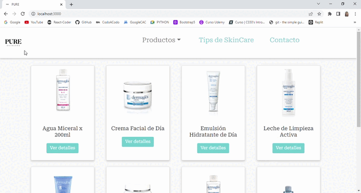

# Proyecto de desarrollo Frontend con React Js
  [](https://app.netlify.com/sites/pureskincare/deploys)

## Acerca del Proyecto

-------------------------

### Descripción

Desarrollo de una tienda de venta de productos de Skincare con React JS utilizando Create React App y una base de datos en Firebase.




-------------------------

### Tecnologías utilizadas

#### 1. React JS v17+ 
Tecnología del curso.
#### 2. React-Router-Dom v6+
Librería seleccionada por el curso para el manejo de rutas y navegación.
#### 3. Bootstrap v5+
Utilicé Bootstrap para darle estilo a la página.
#### 4. Toastify v8+
Utilicé Toastify para mostrar mensajes de alerta en 3 momentos del proceso de compra: cuando se agrega un producto al carrito, cuando se envía un formulario de contacto y cuando se finaliza la compra.
#### 5. Google Fonts
Lo utilicé tanto para la fuente de la página como para los íconos.
#### 5. Loaders.css
Utilicé Loaders para mostrar una animación en la página mientras se cargan los productos.
#### 6. Firebase v9+
Firebase fue la base de datos seleccionada por el curso para el manejo del listado de productos y el listado de compras realizadas.
#### 7. Netlify 
Hosting elegido para hacer un deploy del proyecto.

[Ver Página](https://pureskincare.netlify.app/)

------------------------------
### Uso / Instalación

1. Clonar repositorio
```
git clone https://github.com/emialler/TiendaSkinCare-AllerAtucha.git
```
2. Ir al directorio del proyecto
```
cd TiendaSkinCare-AllerAtucha
```
3. Instalar dependencias
```
npm install
```
4. Iniciar servidor
```
npm start
```
------------------------------

## Acerca de Mí

Mi nombre es Emilia Aller Atucha, tengo 31 años, vivo en Mar del Plata y soy estudiante de programación Full Stack en Coder House y en Codo a Codo (Agencia de aprendizaje a lo largo de la vida - Ciudad de Bs As).
Te invito a conectar en Linkedin!

[ LinkedIn](https://www.linkedin.com/in/emilia-aller-atucha/)

